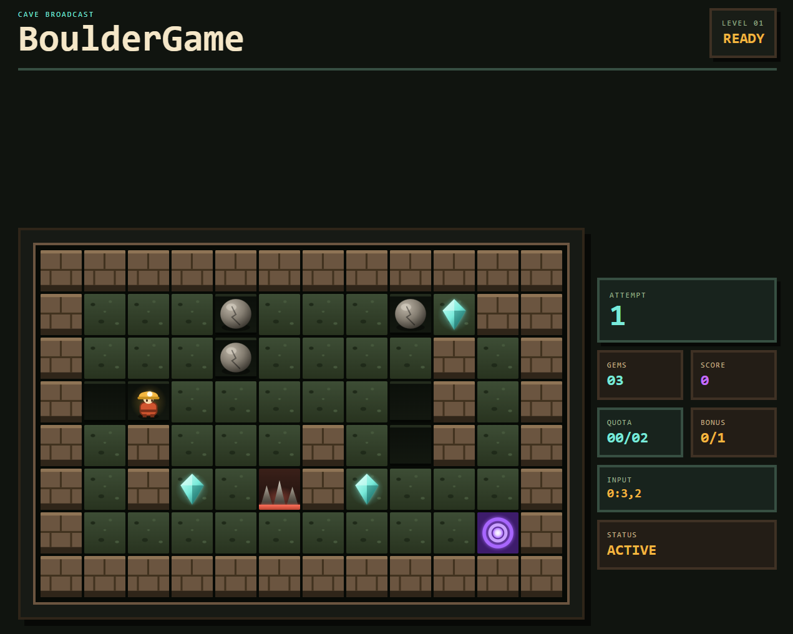

# BoulderGame



A web arcade game MVP in the spirit of Boulder Dash, built for fast public playtests and retro replayability.

## Tech Stack

- [Astro](https://astro.build/) v7 - Modern web framework with server-first rendering
- [React](https://react.dev/) v19 - UI library for interactive components
- [TypeScript](https://www.typescriptlang.org/) v5 - Type-safe JavaScript
- [Tailwind CSS](https://tailwindcss.com/) v4 - Utility-first CSS framework
- [Supabase](https://supabase.com/) - Authentication and backend-as-a-service
- [Cloudflare Workers](https://workers.cloudflare.com/) - Edge deployment runtime

## Prerequisites

- Node.js v22.14.0 (as specified in `.nvmrc`)
- npm (comes with Node.js)

## Getting Started

1. Clone the repository:

```bash
git clone <repository-url>
cd BoulderGame
```

2. Install dependencies:

```bash
npm install
```

3. Configure optional Supabase scaffold variables only if you work on the starter auth routes — see [Supabase Configuration](#supabase-configuration) below.

4. Create a `.dev.vars` file for local Cloudflare dev secrets:

```bash
cp .env.example .dev.vars
```

5. Run the development server:

```bash
npm run dev
```

## Available Scripts

- `npm run dev` - Start development server (Cloudflare workerd runtime)
- `npm run build` - Build for production
- `npm run preview` - Preview production build
- `npm run lint` - Run ESLint with type-checked rules
- `npm run lint:fix` - Auto-fix ESLint issues
- `npm run format` - Run Prettier
- `npm run test:e2e` - Run local Playwright smoke checks
- `npm run test:e2e:ui` - Run Playwright in UI mode for local debugging
- `npm run deploy:site-check` - Validate `PUBLIC_SITE_URL` before production deploy
- `npm run deploy:dry-run` - Build and compile the Cloudflare Worker upload without publishing
- `npm run deploy` - Validate site metadata, build, and deploy `boulder-game` after human approval
- `npm run deploy:tail` - Tail live Worker logs for `boulder-game`
- `npm run deploy:list` - List recent Cloudflare Worker deployments
- `npm run deploy:status` - Show current Cloudflare Worker deployment status
- `npm run deploy:rollback` - Roll back to a previous Worker deployment after human approval

## BoulderGame MVP Guardrails

The game MVP keeps three product guardrails in code so future slices can verify them consistently:

- First play session ready in less than 3 seconds.
- In-game input response in less than 100 ms.
- Replay signal proven by 3 attempts in one local browser session.

The canonical thresholds, test IDs, and session-local attempt counter contract live in `src/lib/game-guardrails.ts`.
Attempt count is stored client-side for the current session only; no account, profile, database, or analytics service is required for the MVP.

Run the local smoke checks with:

```bash
npx playwright install
npm run test:e2e
```

These checks are intentionally local-only for now. They verify anonymous entry, keyboard movement, gem collection, loss, safe completion, risky higher-score completion, replay, and the 3-attempt repeat-play target; CI still runs lint and build only.

## Project Structure

```md
.
├── src/
│ ├── layouts/ # Astro layouts
│ ├── pages/ # Astro pages
│ │ └── api/ # API endpoints
│ ├── components/ # UI components (Astro & React)
│ └── assets/ # Static assets
├── public/ # Public assets
├── wrangler.jsonc # Cloudflare Workers config
```

## Supabase Configuration

This starter still includes [Supabase](https://supabase.com/) authentication scaffolding, but the BoulderGame MVP is no-auth and does not require Supabase for the public playtest path. Environment variables are declared via Astro's `astro:env` schema as optional server-only secrets — they are never exposed to the client.

### First-time setup (local, no cloud project needed)

Requires [Docker](https://www.docker.com/) and ~7 GB RAM.

1. Create your `.env` file:

```bash
cp .env.example .env
```

2. Initialize the local Supabase project (creates a `supabase/` config folder):

```bash
npx supabase init
```

3. Start the local stack (downloads Docker images on first run):

```bash
npx supabase start
```

4. Copy the credentials printed by the CLI into your `.env` and `.dev.vars`:

```
SUPABASE_URL=http://127.0.0.1:54321
SUPABASE_KEY=<anon key from CLI output>
```

5. To stop the stack when done:

```bash
npx supabase stop
```

The local Studio UI is available at `http://localhost:54323`.

No database tables or migrations are required — this project uses Supabase Auth's built-in `auth.users` table only.

### Using a cloud Supabase project instead

If you prefer to use a hosted Supabase project, add these variables to your `.env` and `.dev.vars` files:

| Variable       | Description                                                |
| -------------- | ---------------------------------------------------------- |
| `SUPABASE_URL` | Project URL from Supabase dashboard → Settings → API       |
| `SUPABASE_KEY` | `anon` public key from Supabase dashboard → Settings → API |

```
SUPABASE_URL=https://<project-ref>.supabase.co
SUPABASE_KEY=<anon-key>
```

### Email confirmation in local development

By default Supabase requires email confirmation before a user can sign in. To skip this during local development:

1. Open the Supabase dashboard for your project
2. Go to **Authentication → Email → Confirm email**
3. Toggle it **off**

Users can then sign in immediately after sign-up without clicking a confirmation link.

### Auth routes

| Route                 | Description                                                             |
| --------------------- | ----------------------------------------------------------------------- |
| `/auth/signin`        | Email/password sign-in form                                             |
| `/auth/signup`        | Email/password sign-up form                                             |
| `/auth/confirm-email` | Post-signup "check your inbox" page                                     |
| `/dashboard`          | Example protected page (redirects to `/auth/signin` if unauthenticated) |

Route protection is handled in `src/middleware.ts`. Add paths to the `PROTECTED_ROUTES` array there to require authentication.

## Deployment

This project deploys to [Cloudflare Workers](https://workers.cloudflare.com/) as `boulder-game`. Set `PUBLIC_SITE_URL` to the real Workers URL before release builds, for example `https://boulder-game.your-account.workers.dev`; replace it only after a custom domain is explicitly approved.

First production deployment, domain changes, paid plan changes, destructive data operations, and primary secret rotation require human approval.

1. Run local verification:

```bash
npm run lint
npm run build
npm run test:e2e
```

2. Compile the Worker upload without publishing:

```bash
npm run deploy:dry-run
```

3. Set the confirmed public URL before production deploy:

```bash
export PUBLIC_SITE_URL=https://boulder-game.your-account.workers.dev
npm run deploy:site-check
```

4. Authenticate Wrangler if needed:

```bash
npx wrangler login
```

5. Deploy with Wrangler after approval:

```bash
npm run deploy
```

Record the URL printed by Wrangler in the playtest notes or release issue.

6. Inspect runtime logs and deployment state:

```bash
npm run deploy:tail
npm run deploy:list
npm run deploy:status
```

7. If a deployed version must be reverted, use rollback after approval:

```bash
npm run deploy:rollback
```

Set `SUPABASE_URL` and `SUPABASE_KEY` as Cloudflare secrets only if the scaffold auth routes remain in use for a non-MVP path.

## CI

GitHub Actions runs lint + build on every push and PR to `main` and `master`. This repository does not deploy to production from CI yet.

## License

MIT
